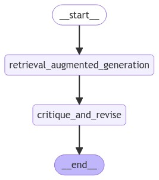
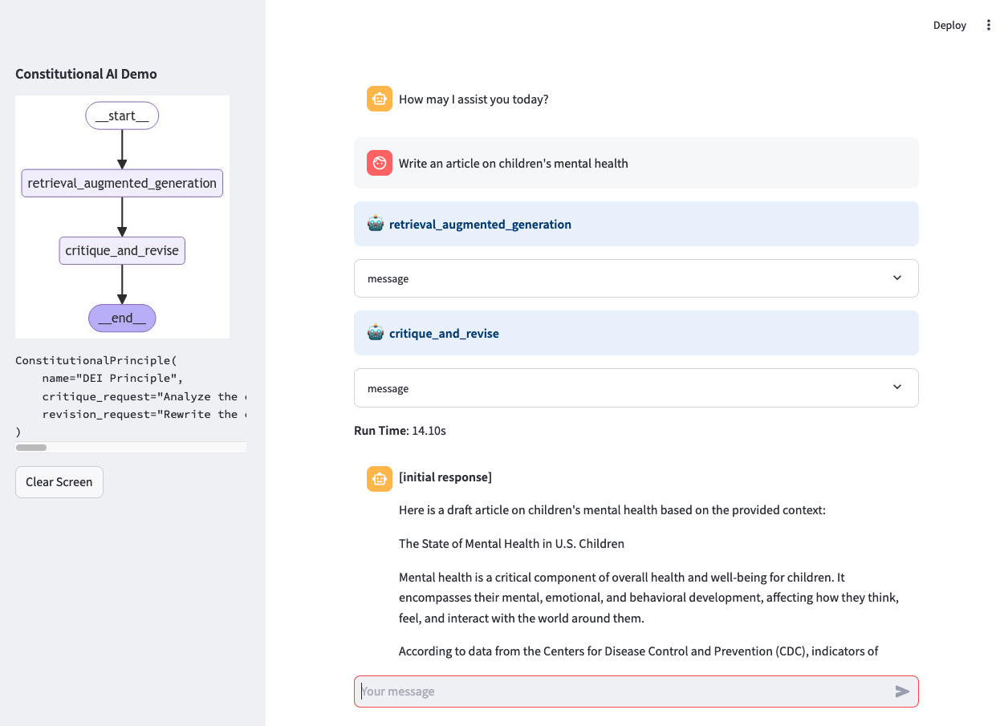

# Constitutional Chain Demo

## NAMER Tech Summit 2024 Session

### Topic
Generate compliant content with Amazon Bedrock and Constitutional Chain

### Abstract
This session explores the use of generative AI for rapid content creation in highly regulated industries like finance and healthcare. While AI offers significant productivity benefits, ensuring compliance with strict regulations such as HIPAA and PCI is crucial. Manual validation of AI-generated content for regulatory adherence can be time-consuming and challenging. The session introduces LangChain's constitutional AI as an innovative solution to streamline compliance validation. By leveraging advanced natural language processing, this approach ensures AI-generated content aligns with industry-specific compliance standards and responsible AI principles, such as eliminating gender bias. This method reduces manual effort in content review while maintaining productivity and compliance. The goal is to help organizations harness generative AI's full potential while confidently navigating complex regulatory requirements in highly regulated sectors.

## LangGraph - Workflow



## Demo



### Prerequisite
Amazon Bedrock KnowledgeBase with PDFs in S3
- [The Mental Health of People with Disabilities _ CDC.pdf](./PDFs/The%20Mental%20Health%20of%20People%20with%20Disabilities%20_%20CDC.pdf)
- [The State of Mental Health and Aging in America - mental_health.pdf](./PDFs/The%20State%20of%20Mental%20Health%20and%20Aging%20in%20America%20-%20mental_health.pdf)
- [The State of Mental Health of Children.pdf](./PDFs/The%20State%20of%20Mental%20Health%20of%20Children.pdf)

### Streamlit App

```
pip install -r requirements.txt

streamlit run main.py
```

Refer to this link for using AWS Jupyter proxy to access Streamlit App. 
https://aws.amazon.com/blogs/machine-learning/build-streamlit-apps-in-amazon-sagemaker-studio/

* Modify the Studio URL, replacing lab? with proxy/8501/

## Reference
**Migrating from ConstitutionalChain - Legacy to LangGraph**

- https://python.langchain.com/v0.2/docs/versions/migrating_chains/constitutional_chain/


